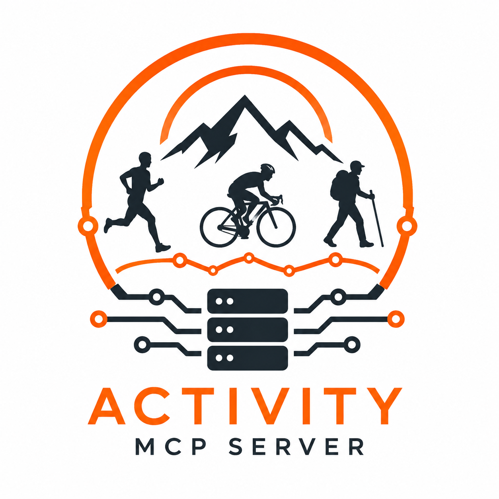

# Strava MCP Server

<p align="center">
  
</p>

An MCP (Model Context Protocol) server that uses the Strava API to let you query your activities, stats, routes, and more from any MCP-compatible client.

## Tools

| Tool | Description |
|------|-------------|
| `get_athlete` | Get your profile information |
| `get_athlete_stats` | Get all-time, YTD, and recent stats |
| `get_athlete_zones` | Get heart rate and power zones |
| `get_athlete_clubs` | List clubs you're a member of |
| `get_activities` | List your activities (paginated) |
| `get_activity` | Get detailed activity data (splits, laps, segments) |
| `get_activity_laps` | Get laps for a specific activity |
| `get_activity_comments` | Get comments on an activity |
| `get_activity_kudos` | Get athletes who gave kudos on an activity |
| `get_routes` | List your saved routes |
| `get_segment` | Get detailed info about a segment |
| `get_segment_effort` | Get a specific segment effort |
| `get_starred_segments` | List your starred segments |
| `explore_segments` | Find segments in a geographic area |

## Setup

### 1. Create a Strava API App

Go to [strava.com/settings/api](https://www.strava.com/settings/api) and create an application. Note your **Client ID** and **Client Secret**.

### 2. Get a Refresh Token (one-time setup)

The server needs a refresh token to authenticate with Strava on your behalf. You only need to do this once.

**a)** Open this URL in your browser (replace `YOUR_CLIENT_ID`):

```
https://www.strava.com/oauth/authorize?client_id=YOUR_CLIENT_ID&response_type=code&redirect_uri=http://localhost&scope=read,activity:read_all&approval_prompt=auto
```

**b)** After authorizing, you'll be redirected to `http://localhost?code=SOME_CODE`. Copy the `code` value from the URL.

**c)** Exchange the code for a refresh token:

```bash
curl -X POST https://www.strava.com/oauth/token \
  -d client_id=YOUR_CLIENT_ID \
  -d client_secret=YOUR_CLIENT_SECRET \
  -d code=SOME_CODE \
  -d grant_type=authorization_code
```

The response will include a `refresh_token` — save it for the next step.

### 3. Configure Environment

```bash
cp .env.example .env
```

Edit `.env` with the credentials from the previous steps:

- `STRAVA_CLIENT_ID` — from your app on [strava.com/settings/api](https://www.strava.com/settings/api)
- `STRAVA_CLIENT_SECRET` — from the same app settings page
- `STRAVA_REFRESH_TOKEN` — from the token exchange response in step 2

### 4. Install Dependencies

```bash
pip install -r requirements.txt
```

### 5. Add to Your MCP Client

Add the server to your MCP client config. The client will automatically start and manage the server — no need to run it manually.

#### GitHub Copilot CLI

Add to `~/.copilot/mcp-config.json`:

```json
{
  "mcpServers": {
    "strava": {
      "command": "/path/to/strava-mcp-server/venv/bin/python",
      "args": ["/path/to/strava-mcp-server/server.py"],
      "cwd": "/path/to/strava-mcp-server"
    }
  }
}
```

#### Claude Desktop

Add to your Claude Desktop config:

```json
{
  "mcpServers": {
    "strava": {
      "command": "/path/to/strava-mcp-server/venv/bin/python",
      "args": ["/path/to/strava-mcp-server/server.py"],
      "env": {
        "STRAVA_CLIENT_ID": "your_client_id",
        "STRAVA_CLIENT_SECRET": "your_client_secret",
        "STRAVA_REFRESH_TOKEN": "your_refresh_token"
      }
    }
  }
}
```

> **Note:** Replace `/path/to/strava-mcp-server` with the actual path on your machine. Use the virtualenv Python (`venv/bin/python`) to ensure dependencies are available.

## License

MIT
